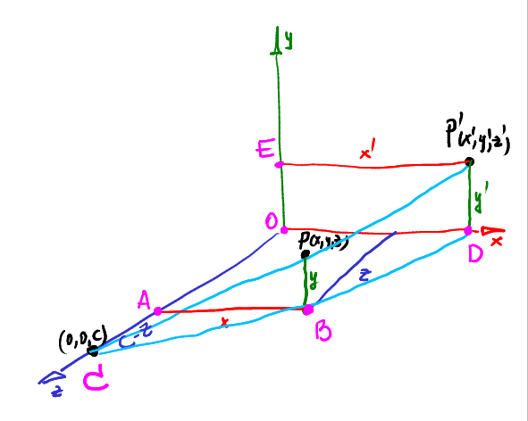
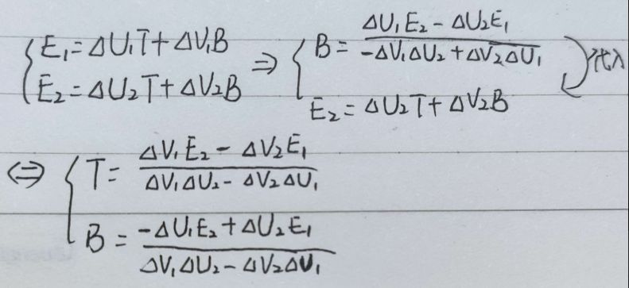
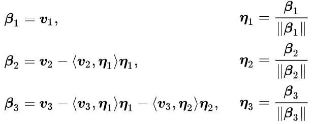
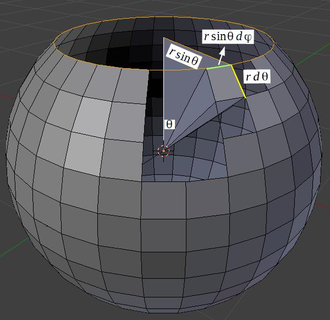
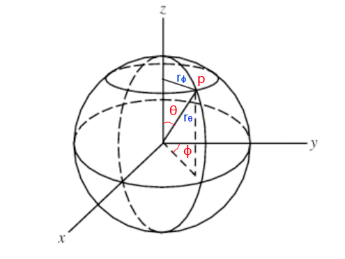

# tinyrenderer笔记

## 绘制线段

1. 给出两个点
2. 按照x或y进行像素步进
3. 为了代码简练, 固定从小到大进行步进即可, 因此需要判断起点和终点的位置进行交换
4. 为了防止线段断裂, 需要按照长边方向进行步进
5. 通过两次交换来使得遍历总是按照x来执行, 其中步进方向的设置只要用一个标记使绘制的时侯xy交换回去即可
6. 没有必要在每次步进的时侯都计算一次当前比例坐标t然后再计算短轴坐标, 可以提前计算每次步进的短轴增量然后复用
7. 因为短轴比较短, 因此可以让增量固定为1, 然后计算一个累进误差判断是否需要增加坐标, 每当误差大于0.5时, 向短边方向更新当前的短轴坐标1像素, 然后将累进误差减1
8. 而这个误差值也无需是浮点, 因为这个浮点数仅仅是为了与0.5进行比较. 从斜率的角度考虑, 当短轴的累计比长轴长时, 短轴就应该进行步进了, 因此我们可以用短边的长度\*2作为步进误差, 判断这个误差是否大于长边就可以起到浮点数对比0.5一样的效果, 这样可以省去浮点计算.

## 绘制三角形

1. 边缘显然画线即可, 核心是填充颜色
2. 填充颜色最古老的算法是扫描线法, 核心思路是用平行线以某个轴为方向将三角形内都填上值
3. 扫描线法的核心是找到需要填充的平行线两个端点
4. 简单的方法是将三角形的顶点按y排序, 然后根据y值在中间的点将三角形划分为上下两部分
5. 以y为轴进行遍历, 对每个y值通过插值找到对应两边的x值, 然后对整个线填上颜色
6. 由于三角形被划分为两部分, 因此都可以简单地线性插值得到两段的x
7. 而实际上更常用的三角形填充算法是包围判断法, 这种方法更粗暴但是很适合并行计算
8. 首先对每个三角形计算出对应的包围盒, 然后对盒内的每个像素, 通过重心坐标判断点是否在三角形内(重心坐标全在(0,1)内就代表点在三角形内), 然后对那些点进行着色
9. 给三角形着色的时侯要记得将顶点位置转为整数防止由于精妙的位数差异计算时出现空隙

## Z缓冲

1. 设置Z缓冲的目的是完成深度测试, 替代画家算法复杂的面片划分和BSD排序过程
2. 基本思路就是利用三角形绘制时得到的像素重心坐标, 插值顶点得到各个像素的z值, 然后只保留离相机最近的z值
3. 因此Z缓冲需要光栅化才能进行
4. 得到Z缓冲后渲染的时侯只绘制Z最大(离相机最近)的片元

## 透视投影

1. 透视投影是一种变形, 核心需要用到齐次坐标的仿射变换
2. 齐次坐标仿射变换矩阵很好理解, 就是一个仿射变换矩阵加上一行, 矩阵最后一行默认是0001
3. 矩阵的前三行代表了对目标矩阵(列向量组)对应分量的变换, 最后一列代表位移
4. 当需要处理的向量最后一行为1时, 代表对方是顶点, 需要进行位移, 0的时侯则位移会被忽视
5. 这个过程实际上是将目标量升维进行处理, 处理完一般通过除最后一行的量来进行降维投影
6. 然后变换可以写出级联的变换矩阵, 通常是先将目标移动到旋转点, 然后应用旋转矩阵, 再移回原来的位置, 这样的三矩阵级联结构, 由于矩阵级联的便利性, 这种矩阵可以提前预计算来使用
7. 齐次仿射变换矩阵的最后一行默认是0001, 但是这一行也可以修改, 通常来说是给倒数第二个分量(z)改变值, 这一行代表了要沿什么轴进行成比例的缩放, 中心投影的情况就是[0 0 1-z/c 1]. 
8. 使用这个新矩阵对顶点进行处理后再将顶点的最后一维同除为1, 就能得到投影变形后的顶点位置, 此时再使用正交投影即可绘制出透视投影的效果, 如下图
9.   

## 相机变换

1. 不记得推导了, 得重看书

## 渲染管线

1. 首先是对各种素材的读取
2. 然后构造模型变换矩阵, 视框矩阵和投影矩阵, 乘在一起
3. 传入顶点着色器, 按照给定的矩阵进行顶点处理, 主要就是负责顶点位置的变换
4. 顶点着色器顺便返回了一些额外信息
5. 然后进行三角形光栅化, 将顶点构成的图元转变为像素(这一步是最慢的), 像素被称为片段, 带有例如重心坐标, 深度值之类的信息, 光栅化是性能消耗最大的部分
6. 顶点着色器传出的法线坐标UV坐标在光栅化到片段着色器时都由硬件在一定可配置的情况下进行了带有透视矫正的线性插值, 但也有部分实现是由用户自己在片段着色器中完成插值
6. 片段传入片段着色器进行着色, 这一步消耗也比较大, 片段着色器常常都比较复杂
7. 片段着色器返回像素颜色和深度, 然后进行深度测试, 只将深度最大的值保存到帧缓存
8. 完成一轮简单的渲染

## 法线贴图

1. 使用法线的时候记得要先进行变换, (X/255)\*2-1
2. 使用法线的时侯需要逆矩阵变换, 同时光源需要顺矩阵变换才能使用, 注意视图变换不用进入
3. 即使是从面片直接生成的法线也需要变换, 可能是我代码没写好的缘故

## 切线空间

1. 切线空间（Tangent Space）完全解析: https://zhuanlan.zhihu.com/p/139593847
2. 法线贴图都是定义在切线空间中的, 需要定义在切线空间中是为了满足可变形的物体, 世界空间的法线不能随着表面变形而自动改变, 切线空间由于依赖物体表面存在所以可以改变
2. 面法线仅仅规定了面的正反用于处理可见性, 光照至少都是使用顶点法线进行的, 顶点法线是人为设置的, 不一定是面法线的平均
3. 每个顶点都有自己的UV信息, 二维空间里的UV坐标可以通过换轴到三维TBN空间中进行表示, 从而将二维空间的点转为三维
4. 切线空间中的TB是主切线和副切线, 主副切线并不一定是垂直的. N轴就是顶点法线, TB总与N垂直, 因此当N不垂直于面片时, TB法线就不在三角形面上
5. 按照三角形当前顶点与另两个顶点形成的向量E1和E2配合各自的UV坐标可以求解出符合UV的TB向量
6.   
7. 但此时的TB并不是真正的TB, 由于TB总与N垂直, 因此再对TB进行正交化得到的TBN矩阵才是正确的切线空间轴
6. 正交化可以使用Gram-Schmidt法, 先定下v1是顶点法线, 然后依次正交化后面的TB切线为正交基即可
7.   
8. 精确的切线空间需要在片段着色器中计算, 这样才能保证每个法线应用的时侯切线基都是正交的, 但是实际中在顶点着色器中计算然后插值也无伤大雅
12. 然后采用坐标系变换的方法, 通过构造一个包含了TBN的基矩阵, 与读取到的法线贴图法线相乘, 就能将法线转到切线空间中, 完成法线的扰动

## 阴影贴图

1. 阴影本质上也是一张贴图, 但是是实时渲染出来并不断变化的
2. 要使用实时的阴影需要multi-pass结构, 就是需要对同一个场景进行多步不同配置的渲染
3. 首先经过一个类似Z缓冲渲染的过程在光源角度渲染一次场景保存到贴图中, 并保存下渲染场景所用的变换矩阵
4. 然后在正式渲染场景的片元着色器中, 对每个片段, 获取其未经过模视变换的坐标, 通过之前渲染深度的矩阵进行变换
5. 变换可以得到光源视角下对应片段的深度和屏幕坐标, 然后按照此坐标在之前渲染的深度贴图中查找
6. 若当前片段深度小于查找到的深度, 意味着当前片段没有被光源看到, 也就是处于阴影中, 进行对应的阴影着色, 一般是作为着色的一个权重
7. 渲染阴影贴图也需要较大的性能消耗, 因为尽管不用复杂的着色但也需要多光栅化渲染一遍场景, 为了加速阴影贴图常常使用较低的分辨率进行渲染
8. 由于光照角度和观察角度一般不相同, 因此应用阴影贴图的时侯常常出现多个片段对应阴影贴图上的同一个深度值, 这一方面会使得角度越大的地方锯齿越明显, 另一方面同一个阴影对应的片段可能由于不同的深度值而出现碎片化(通常是条形)的阴影效果
9. 上面的情况称为阴影失真(Shadow Acne), 一种简单的解决方法是当计算阴影的时侯给物体的实际深度加上一个偏移值, 称为阴影偏移(Shadow Bias), 使得一个阴影像素对应的片段深度尽量不会跨过阴影像素的界限, 能被统一的照亮/变暗
10. 但是阴影偏移又带来另一个问题, 当偏移过大的时侯会看到阴影和物体的位置产生了偏差, 这称为阴影悬浮(Shadow Panning), 可以通过对阴影采用正面剔除方法渲染来处理, 后话

## 球面均匀采样

1. https://mathworld.wolfram.com/SpherePointPicking.html
2. 假如直接在立方体或者按照轴向进行采样, 显然由于球在轴向上的分布的不均匀所以轴向均匀采样投影后也是不均匀的
2. 好一点的做法是在球坐标系的两个方位角上进行均匀采样, 但这依然是错误分布. 这有点不太直观, 简单说, 我们希望球面均匀分布的意思相当于球面每个微分面积, 或者说每个立体角上都均匀分布着采样点.
3. 立体角$\Omega$是平面角的空间类比, 我们知道平面上的弧度角意味着用半径乘这个角度能得到对应段的弧长, 圆的周长是$2\pi r$, 其一周的弧度和为$2\pi$. 立体角则是半径的平方乘这个角度能够得到对应区域的表面积, 球的面积为$4\pi r^2$, 可知球面的立体角之和为$4\pi$, 单位是球面度/平方度(sr)
4. 但立体角并不好使用, 所以我们希望从球坐标系开始推导. 从微分角度来看, 球面上的微分表面积是下图的一个小方形
5.   
6. 纵向的微分角度为$d\theta$, 横向为$d\phi$, 要注意这两个方位角分别对应垂直面上的圆盘和水平面上的圆盘, 垂直面的圆盘始终穿过球心, 方向是水平角决定, 而水平面上的圆盘始终穿过两个角形成的点, 因此水平面的圆盘大小受到垂直角的影响.
7. 所以这里每个方形的纵向长度是垂直面的弧长$rd\theta$, 而水平长度是水平面小圆的弧长$rsin\theta d\phi$, 如下图
8.   
9. 所以形成的矩形面积为$r^2 sin\theta d\phi d\theta$, 所以可知对应立体角的转换为$sin\theta d\phi d\theta$
10. 所以和轴向采样类似的问题也出现了, 由于$\theta$项存在sin的影响, 按照一个轴进行采样得到的结果相当于被sin不均匀地加权了, 接近0的地方权值大, 其它较小. 实际效果是两个极点附近得到了偏多的采样点
11. 考虑到本质上我们希望的是均匀地利用两个方位角来采样微分立体角$d\Omega=sin\theta d\phi d\theta$, 那么只要将整个$\theta$有关的项结合起来使用即可, 回忆高数中的积分变换, 可以将微分写为$d\Omega=-d\phi dcos\theta$, 从而可以写出对应的pdf, 利用逆变换法计算出对应的采样表达式
14. https://blog.csdn.net/u010281174/article/details/109123974
15. 这部分的数学推导要重新梳理

## 离线环境光遮蔽

1. 环境光遮蔽Ambient Occlusion, 即AO, 是为了近似缺少光线追踪算法导致固定漫反射系数. 
2. 环境光缺少光线追踪难以计算, 但是我们可以离线将环境光渲染为材质进行使用
3. 那么最常用的就是一个漫反射系数, 模拟的就是周边均匀的天空光照到模型表面的效果, 只有明暗的加权
3. 方法类似计算阴影贴图, 在一个天空半球上进行随机采样作为视点, 将可见的像素写回材质中, 本质上是在模拟光线追踪的直接照射(无反射)的情况
4. 经过足够数量的迭代后将得到的材质取平均就能得到预渲染的环境光贴图, 再按照高光贴图一样的方法进行着色即可

## 屏幕空间环境光遮蔽

1. 屏幕空间环境光遮蔽Screen Space Ambient Occlusion, 即SSAO