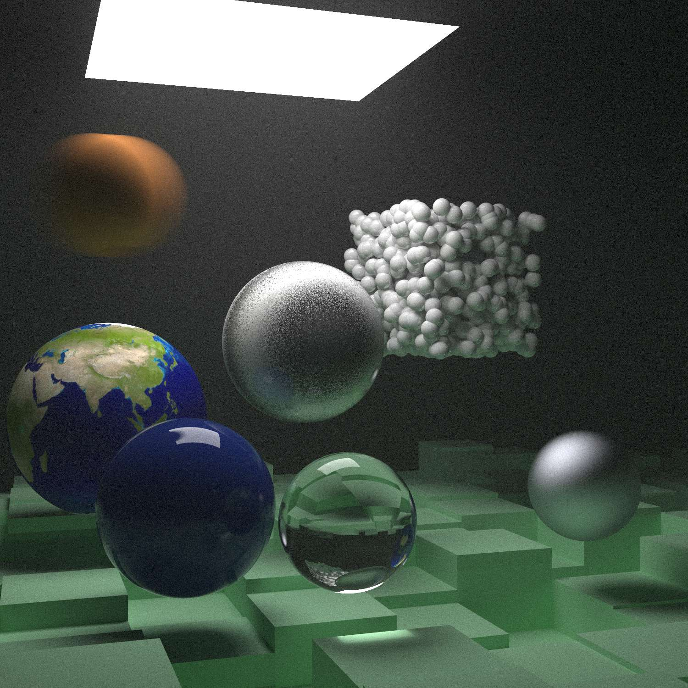

# AmbiRenderer
#### 施工中的玩具渲染器

#### *Hey! Here is my rendering playground!*

## In progress...

### [2021/01/17] Ray Tracing in One Weekend学习结束

### [2021/07/22] Ray Tracing The Next Week学习结束

### 完善光追渲染器

- [x] 简单重构驱动代码
- [ ] 加入图形界面
- [ ] 实现层次超采样
- [ ] 实现三角网格模型的读取和渲染
- [ ] 实现多线程处理
- [ ] 实现透明材质吸收率的设置

**现状:**

## Notes

["Ray Tracing: In One Weekend" Notes](./Documents/Notes/Ray_Tracing_in_One_Weekend/README.md)

["Ray Tracing: The Next Weekend" Notes](./Documents/Notes/Ray_Tracing_The_Next_Week/README.md)