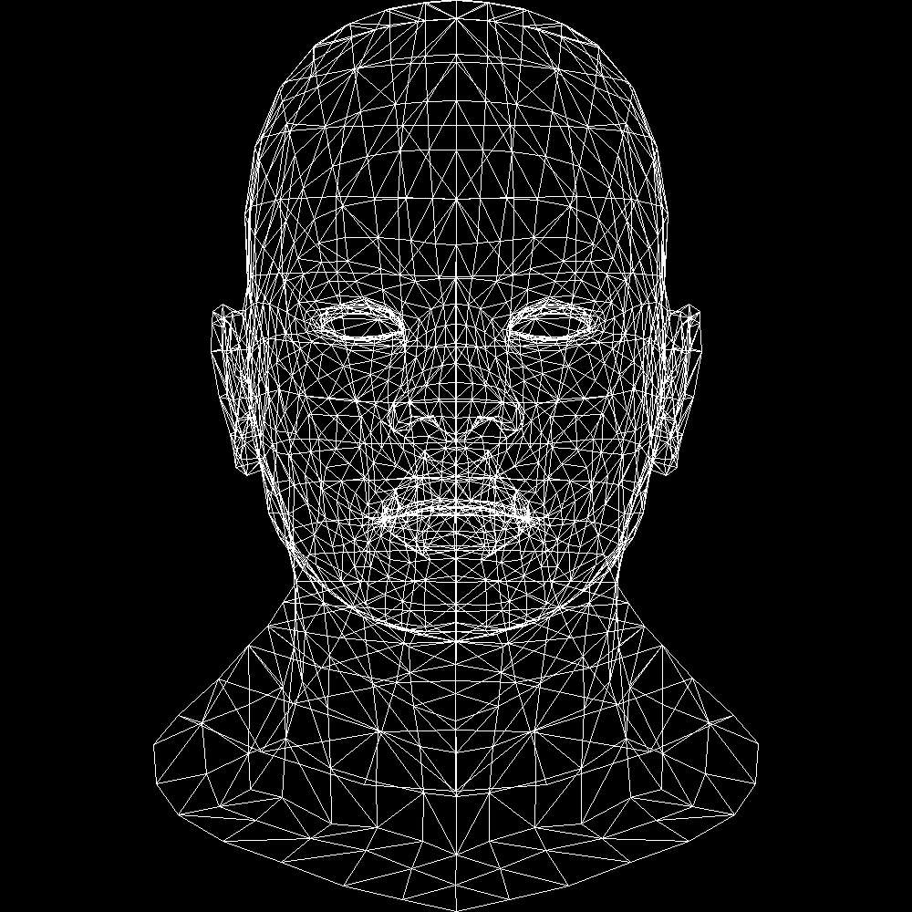

# AmbiRenderer
#### 施工中的玩具渲染器

#### *Hey! Here is my rendering playground!*

## In progress...

### [2021/01/17] Ray Tracing in One Weekend学习结束

### [2021/07/22] Ray Tracing The Next Week学习结束

### 用C++实现简单的软光栅tinyrenderer

https://github.com/ssloy/tinyrenderer

- [x] Lesson 1: Bresenham’s Line Drawing Algorithm
- [x] Lesson 2: Triangle rasterization and back face culling
- [ ] Lesson 3: Hidden faces removal (z buffer)
- [ ] Lesson 4: Perspective projection
- [ ] Lesson 5: Moving the camera
- [ ] Lesson 6: Shaders for the software renderer
- [ ] Lesson 6bis: tangent space normal mapping
- [ ] Lesson 7: Shadow mapping
- [ ] Lesson 8: Ambient occlusion
- [ ] Lesson 9: Real OpenGL (GLSL) application
- [ ] Lesson2的画三角形需要修改为重心坐标包围盒法

**现状:**

## Notes

["Ray Tracing: In One Weekend" Notes](./Documents/Notes/Ray_Tracing_in_One_Weekend/README.md)

["Ray Tracing: The Next Weekend" Notes](./Documents/Notes/Ray_Tracing_The_Next_Week/README.md)