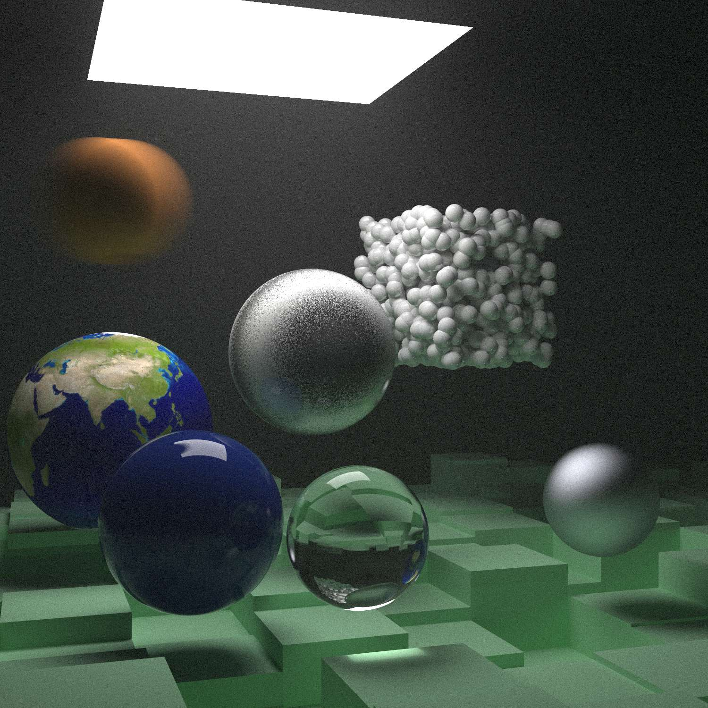

# AmbiRenderer
#### 施工中的玩具渲染器

#### *Hey! Here is my rendering playground!*

## In progress...

### [2021/01/17] Ray Tracing in One Weekend学习结束

### Ray Tracing The Next Week学习

- [x] **Chapter2** 动态模糊效果
- [x] **Chapter3** 层次包围盒
- [x] **Chapter4** 实体纹理
- [x] **Chapter5** Perlin噪声
- [x] **Chapter6** 图片纹理映射
- [x] **Chapter7** 矩形与光照
- [x] **Chapter8** 实例
- [x] **Chapter9** 体积(雾)
- [x] **Chapter10** 最终场景渲染
- [x] BVH似乎处理双层玻璃时有问题, 可能是包围盒的计算出了问题
- [x] 重构了场景载入和摄像机
- [ ] 材质图片的路径有问题

**现状:**

## Notes

["Ray Tracing: In One Weekend" Notes](./doc/Notes/Ray_Tracing_in_One_Weekend/README.md)

["Ray Tracing: The Next Weekend" Notes](./doc/Notes/Ray_Tracing_The_Next_Week/README.md)