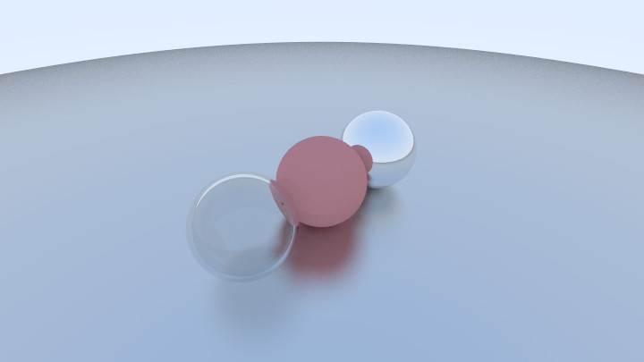

# AmbiRenderer
#### 施工中的玩具渲染器

#### *Here is my rendering playground*

## In progress...

### Ray Tracing in One Weekend学习

- [x] **Chapter1,2** 学习写入ppm图像文件
- [x] **Chapter3** 编写基础数据结构Vec3
- [x] **Chapter4** 编写射线类, 绘制场景背景
- [x] **Chapter5** 绘制一个球
- [x] **Chapter6** 绘制法线和多个球, 其中一个作为地面
- [x] 重构一下代码, 把一些实现的头文件和源文件分离, 减少重定义问题
- [x] **Chapter7** 随机超采样反走样
- [x] **Chapter8** 绘制场景的漫反射
- [x] **Chapter9** 金属材质的镜面反射效果
- [x] **Chapter10** 玻璃等材质的透射效果
- [x] **Chapter11** 可调整的相机
- [ ] **Chapter12** 散焦效果
- [ ] **Chapter13** 最终场景
- [ ] 阅读书上内容, 搞明白折射方程
- [ ] 阅读书上内容, 搞明白Schlick近似

**现状:**

## Ray Tracing