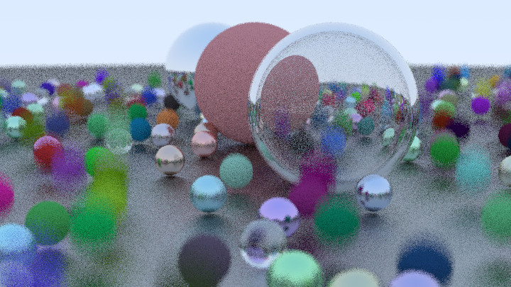

# AmbiRenderer
#### 施工中的玩具渲染器

#### *Hey! Here is my rendering playground!*

## In progress...

### [2021/01/17] Ray Tracing in One Weekend学习结束

### Ray Tracing The Next Week学习

- [x] **Chapter2** 动态模糊效果
- [ ] **Chapter3** 层次包围盒
- [ ] **Chapter4** 实体纹理
- [ ] **Chapter5** Perlin噪声
- [ ] **Chapter6** 图片纹理映射
- [ ] **Chapter7** 立方体与光照
- [ ] **Chapter8** 实例
- [ ] **Chapter9** 体积雾
- [ ] **Chapter10** 最终场景渲染

**现状:**

