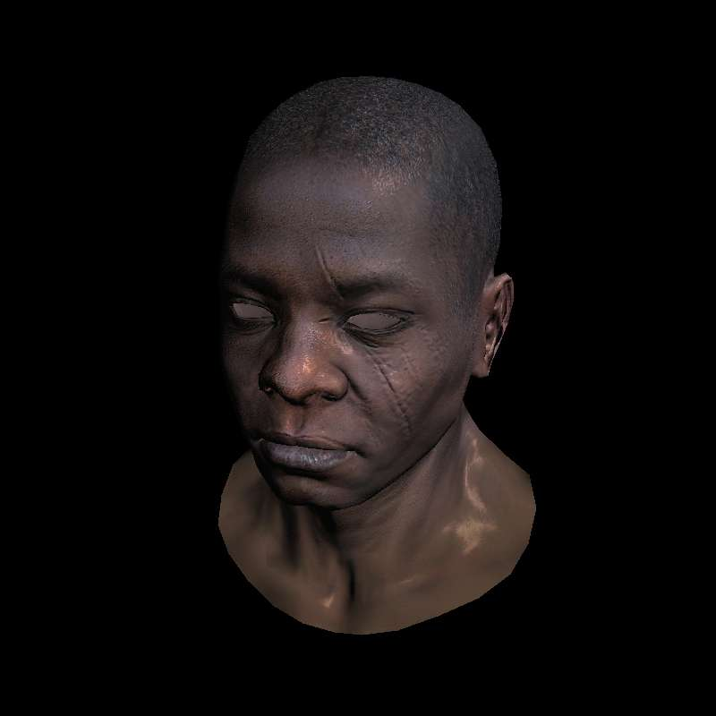

# AmbiRenderer
#### 施工中的玩具渲染器

#### *Hey! Here is my rendering playground!*

## In progress...

### [2021/01/17] Ray Tracing in One Weekend学习结束

### [2021/07/22] Ray Tracing The Next Week学习结束

### C++简单软光栅tinyrenderer

https://github.com/ssloy/tinyrenderer

- [x] Lesson 1: Bresenham’s Line Drawing Algorithm
- [x] Lesson 2: Triangle rasterization and back face culling
- [x] Lesson 3: Hidden faces removal (z buffer)
- [x] Lesson 4: Perspective projection
- [x] Lesson 5: Moving the camera
- [x] Lesson 6: Shaders for the software renderer
- [x] Lesson 6bis: tangent space normal mapping
- [ ] Lesson 7: Shadow mapping
- [ ] Lesson 8: Ambient occlusion
- [ ] Lesson 9: Real OpenGL (GLSL) application
- [ ] 完善渲染管线的组成
- [ ] 优化片元着色器, 将顶点插值改写为固定管线
- [ ] 提前深度测试
- [ ] 透视矫正
- [ ] 优化光栅化效率: https://zhuanlan.zhihu.com/p/140926917
- [ ] 视体裁剪, 背面裁剪
- [ ] 用四元数来进行旋转

**现状:**

## Notes

["Ray Tracing: In One Weekend" Notes](./Documents/Notes/Ray_Tracing_in_One_Weekend/README.md)

["Ray Tracing: The Next Weekend" Notes](./Documents/Notes/Ray_Tracing_The_Next_Week/README.md)