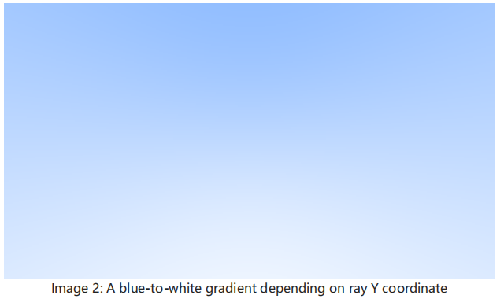
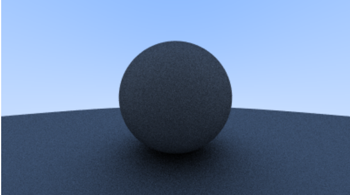
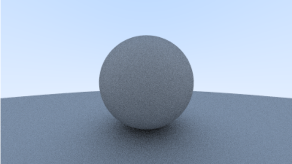
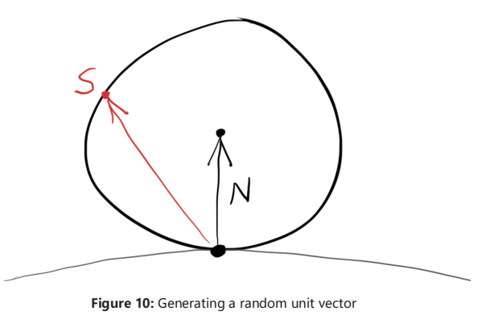

# "Ray Tracing: In One Weekend" Notes

- ["Ray Tracing: In One Weekend" Notes](#ray-tracing-in-one-weekend-notes)
  - [2. Output an Image](#2-output-an-image)
    - [最简的渲染输出](#最简的渲染输出)
  - [3. The vec3 Class](#3-the-vec3-class)
  - [4. Rays, a Simple Camera, and Background](#4-rays-a-simple-camera-and-background)
    - [天空光背景](#天空光背景)
  - [5. Adding a Sphere](#5-adding-a-sphere)
  - [6. Surface Normals and Multiple Objects](#6-surface-normals-and-multiple-objects)
    - [简化的求交运算](#简化的求交运算)
  - [7. Antialiasing](#7-antialiasing)
    - [超采样](#超采样)
  - [8. Diffuse Materials](#8-diffuse-materials)
    - [Gamma校正](#gamma校正)
    - [Lambert漫反射近似](#lambert漫反射近似)
  - [9. Metal](#9-metal)
  - [10. Dielectrics](#10-dielectrics)
  - [11. Positionable Camera](#11-positionable-camera)
  - [12. Defocus Blur](#12-defocus-blur)

## 2. Output an Image

### 最简的渲染输出

将像素直接写入PPM文件中, 然后再通过图片浏览器来渲染显示PPM文件. PPM文件不进行压缩且格式简单, 可以用来作为各种算法的中间件.

PPM格式常常按照回车分割, 空格间隔, #号注释, 分别是:
- 格式标志
- 宽度 高度
- 最大颜色值
- R G B
- ...

其中格式标志通常写P3, 代表格式是ASCII的RGB像素图. 样例PPM文件如下:

  

## 3. The vec3 Class

## 4. Rays, a Simple Camera, and Background

### 天空光背景

在选定的两个颜色之间进行一个轴方向的插值, 由于光线追踪按照视平面像素进行投影的特性, 投影点在平面的不同位置上变化时, 轴向的变化并不是均匀的, 也就是如果将其轴向均匀变化点连成等高线图会发现图是圆形波纹状的, 利用这个特性进行线性插值可以得到接近于真实天空光的颜色球面渐变效果.

  

## 5. Adding a Sphere

## 6. Surface Normals and Multiple Objects

### 简化的求交运算

射线求交一般通过求解线与面的方程得到, 例如求直线与球是否有交点就是求解参数形式的直线是否能够找到一个点与球心距离正好等于半径:

$$
(A+tb-C)(A+tb-C)=r^2
$$

在这个过程使用求根公式的时候, 常常将求根公式改写为下面形式以减少乘法的使用, 其中b=2h:

$$
\frac{-b \pm\sqrt{b^2-4ac}}{2a}= \frac{-h \pm\sqrt{h^2-ac}}{a}
$$

## 7. Antialiasing

### 超采样

光线追踪中, 由于光线反射的随机性, 超采样反走样几乎是必须的步骤, 否则得到的画面会充满噪点. 采样的方法FCG中已经介绍了几种, 原文使用的是简单的随机采样, 稳定性不够, 有待改进为分层采样.

## 8. Diffuse Materials

### Gamma校正

Gamma校正是一个幂函数$x^{1/ \gamma}$, 其作用是将物理性质上的反射率映射为人眼心理认为的合理反射率, 因为人眼对于光线强度的感受是非线性的, 对低能量信息有较强的分辨能力, 1/2的白色理论上是正灰色, 但是实际上人眼会感受为浅灰偏白色. 但是我们的显示器是直接显示真实像素值的, 并不会考虑人眼的心理特性. 因此我们需要手动在将图像送给显示器前对画面的颜色进行校正, 这就是Gamma矫正. 实际中常用的Gamma值为2.2, 在这系列书的渲染器中选择了固定Gamma为2, 因为这样校正后的颜色值可以通过简单开方得到.

通常来说Gamma校正的效果就是画面会变得更亮, 实际生活中适合人眼的Gamma值还与环境光线显示器亮度等种种因素有关, 因此大多数渲染程序都给出可以自行调整的Gamma值.

  

  

### Lambert漫反射近似

漫反射光的方向是利用接受-拒绝采样从[-1,1]球上采取的, 然后通过与法线进行相加或进行符号判断来转到[0,2]中. 此时要注意Lambert漫反射的特性, 反射光集中在法线方向分布, 但是光强度均匀分布. 早期很多渲染器由于没有给球面采样的向量进行归一化而得到了能量分布错误的Lambert漫反射, 定要注意.

  

## 9. Metal

通过对镜面反射的反射向量叠加上带有加权的类似漫反射的球面采样向量, 可以得到模糊镜面反射效果.

## 10. Dielectrics

编写透明折射材质时, 可以通过里外放置法线方向相反的两层来得到双层玻璃的效果.

## 11. Positionable Camera

## 12. Defocus Blur